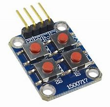

# Micro Python Keypad(2X2) Project



This is a project that uses a 2x2 keypad and four LEDs to demonstrate the input and output capabilities of micro python. The keypad is connected to four pins of the ESP32 board, and the LEDs are connected to four other pins. When a key is pressed, the corresponding LED will blink and the key name will be printed on the serial monitor.

## Requirements

- An ESP32 board
- A 2x2 keypad
- Four LEDs and four resistors
- A breadboard and some jumper wires
- A USB cable
- Micro python firmware installed on the ESP32 board
- A code editor (such as Thonny or uPyCraft)

## Wiring

The keypad has four pins: left down, left up, right down, and right up. They are connected to pins 0, 1, 2, and 3 of the ESP32 board respectively. The LEDs are connected to pins 16, 17, 18, and 19 of the ESP32 board respectively, with resistors in series. The longer leg of the LED should be connected to the pin, and the shorter leg to the resistor.

## Code

The code consists of two parts: importing the libraries and defining the constants and variables, and creating and running the main loop.

### Importing libraries and defining constants and variables

The following libraries are imported:

- `machine` for accessing the hardware pins
- `utime` for delaying operations

Two constants are defined for the key states: `key_up` and `key_down`. A list of lists is created to store the key names: `keys`. The list has two sublists, one for each row of the keypad. Each sublist has two elements, one for each column of the keypad.

Four lists are created to store the pin numbers for the left and right sides of the keypad, and the LEDs: `left`, `right`, `leds`. The pin numbers are chosen according to the wiring diagram.

Four lists of pin objects are created using list comprehensions: `left_pins`, `right_pins`, `led_pins`. The left pins are set to output mode, and the right pins are set to input mode with pull-down resistors. The LED pins are set to output mode.

### Creating and running the main loop

A function called `init` is defined to initialize the left pins to low state. This is done by looping through the left pins list and calling the `low` method on each pin object.

A function called `scan` is defined to scan the keypad for any key press. It takes two parameters: `left` and `right`, which are the indices of the left and right pins lists. It sets the left pin at the given index to high state, and then checks if the right pin at the given index is low or high. If it is low, it means that no key is pressed. If it is high, it means that a key is pressed. It returns either `key_up` or `key_down` accordingly. It then sets the left pin back to low state.

A print statement is used to indicate that the program is ready to receive key presses.

A while loop is used to run indefinitely. Inside the loop, two nested for loops are used to iterate through all possible combinations of left and right pins indices. For each combination, the `scan` function is called with those indices as arguments, and its return value is stored in a variable called `key`. If `key` is equal to `key_down`, it means that a key is pressed. In that case, another print statement is used to display which key was pressed, using the `keys` list as a reference. The variable `last_key_press` is also updated with that key name.

A series of if-elif statements are used to check which key was pressed, and blink the corresponding LED accordingly. This is done by setting the LED pin value to 1 (on), delaying for 0.1 seconds using the `sleep` function from `utime`, and then setting it back to 0 (off).

## Running

To run the code, you need to upload it to your ESP32 board using your code editor. Make sure you have selected the correct port and baud rate for your board. You can also use a serial monitor to see the output of your code.

Once the code is uploaded, you can press any key on the keypad and see its name printed on the serial monitor, and its LED blink on the breadboard.

## Code block

Here is the micro python code in a code block:

```python
#from machine import Pin, Timer
#from machine import PWM
import utime
# import servo 

from machine import Pin as pin
from utime import sleep

led = pin(16, pin.OUT)
ir = pin(0,pin.IN)


# def blink():
#     while True:
#         print(ir.value())
#         if ir.value()==1:
#             led.value(0)
#         else:
#             led.value(1)
# 
# blink()

# def bk():
#     while True:
#         led(1)
#         utime.sleep(1)
#         led(0)
#         utime.sleep(1)
#         
# bk()

#from machine import Pin, Timer
#from machine import PWM
# import utime
# # import servo 

from machine import Pin as pin
from machine import ADC, reset
from utime import sleep
# 
# led1 = pin(16, pin.OUT)
# led2 = pin(0,pin.OUT)
# 
# 
# def blink():
#     while True:
#         print(ir.value())
#         if ir.value()==1:
#             led.value(0)
#         else:
#             led.value(1)
# 
#blink()
led3 = pin(16,pin.OUT)
led4 = pin(17,pin.OUT)
led5 = pin(18,pin.OUT)
led6 = pin(19,pin.OUT)
key_up = const(0)
key_down = const(1)

keys = [['rightdown', 'rightup'], ['leftdown', 'leftup']]

left = [0,1]
right = [2,3]

left_pins = [pin(pin_name, mode=pin.OUT) for pin_name in left]

right_pins = [pin(pin_name, mode=pin.IN, pull=pin.PULL_DOWN) for pin_name in right]

def init():
    for left in range(0,2):
        for right in range(0,2):
            left_pins[left].low()
            
def scan(left, right):
    """scan the keypad"""
    
    left_pins[left].high()
    key = None
    
    if right_pins[right].value() == key_down:
        key = key_down
    if right_pins[right].value() == key_up:
        key = key_up
    left_pins[left].low()
    
    return key

print("start entering the keys")

init()

while True:
    for left in range(2):
        for right in range(2):
            key = scan(left, right)
            if key == key_down:
                print("key pressed is", keys[left][right])
                last_key_press = keys[left][right]
                
                if(keys[left][right] == "leftdown"):
                     led3(1)
                     sleep(0.1)
                     led3(0)
                elif(keys[left][right] == "rightdown"):
                     led4(1)
                     sleep(0.1)
                     led4(0)
                elif(keys[left][right] == "leftup"):
                     led5(1)
                     sleep(0.1)
                     led5(0)
                elif(keys[left][right] == "rightup"):
                    led6(1) 
                    sleep(0.1)
                    led6(0)

```
